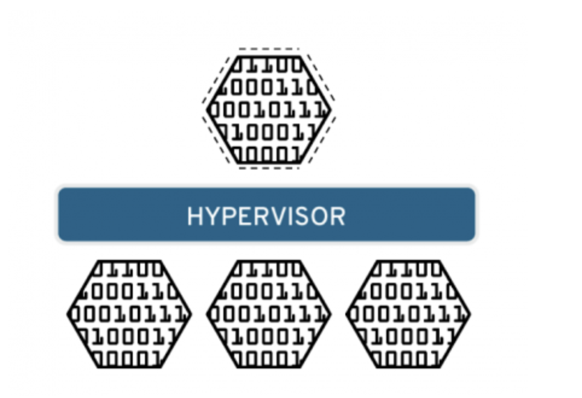
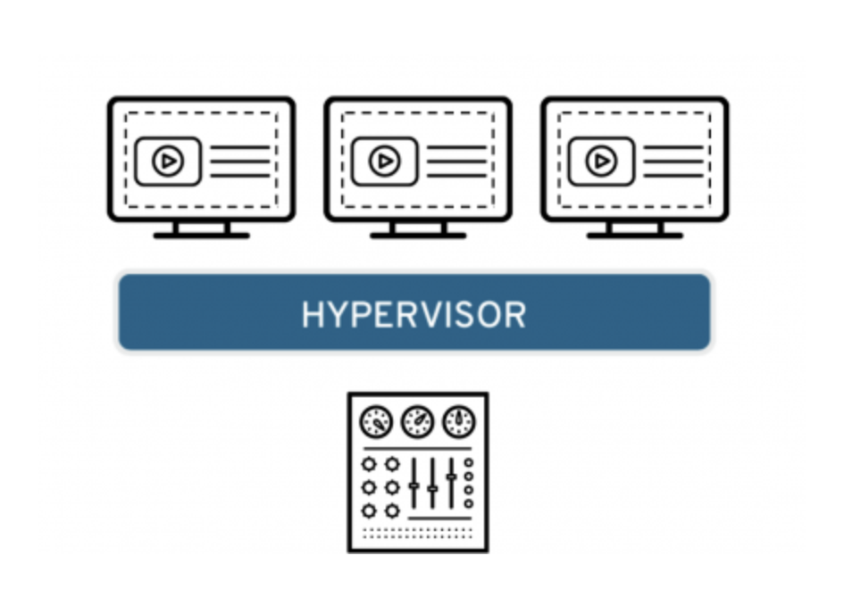
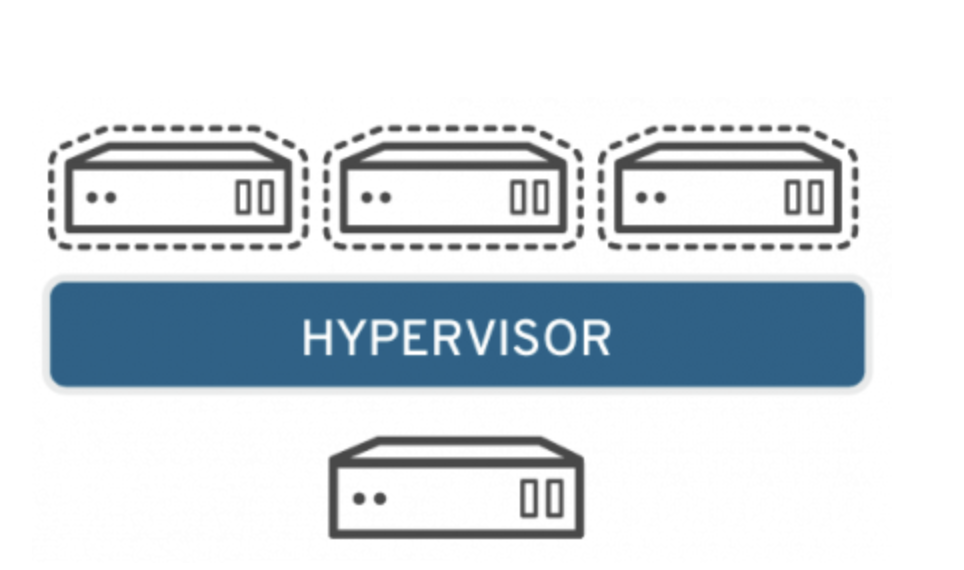
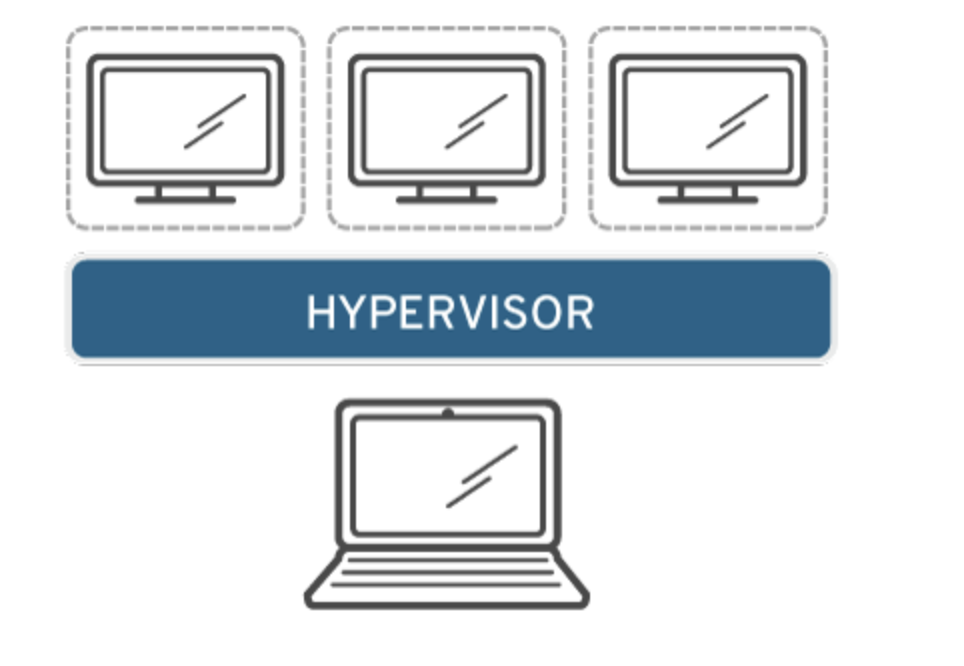
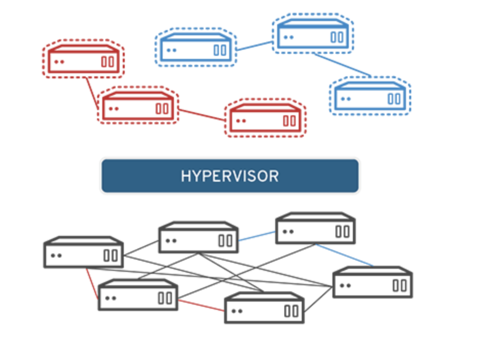
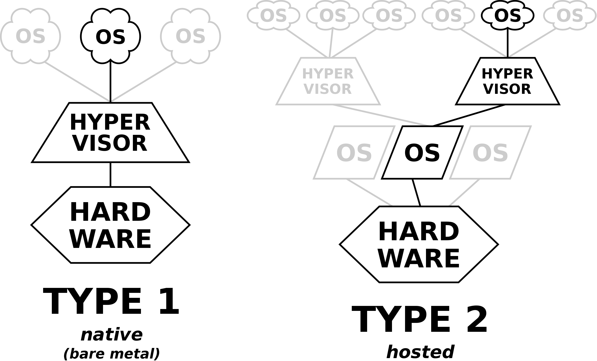
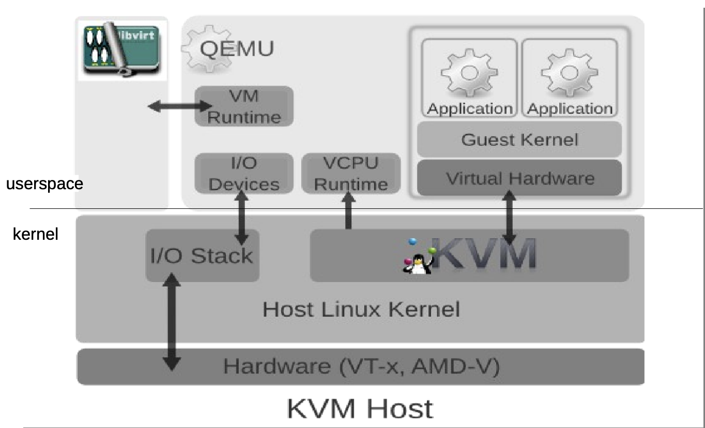
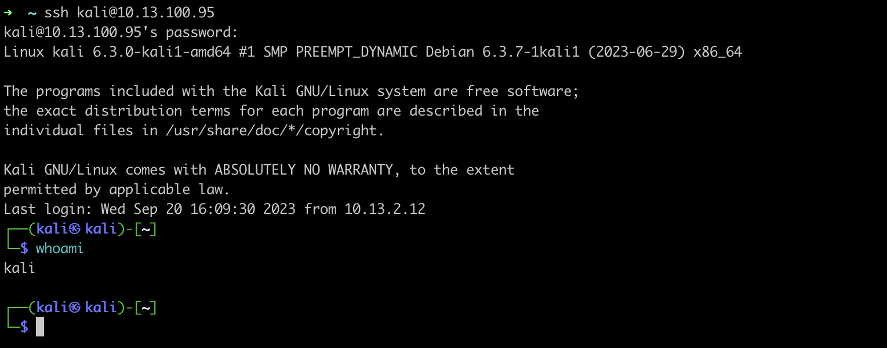
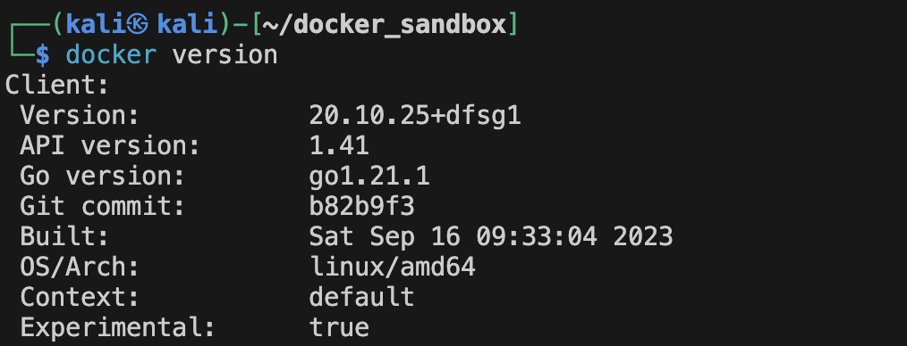

# inception
42's common core project; system administration; containerization

Learning materials: 
-virtualization vs containarization: https://www.trianz.com/insights/containerization-vs-virtualization#:~:text=Containerization%20is%20a%20form%20of,isolate%20processes%20from%20one%20another.

-Docker : https://docker-curriculum.com 

### Virtualization
Is a technology that lets you create usefule IT services using resources that are linked to hardware. It allows you to use the physical machine by distriburing it's capabilities.

#### Types of virtualization
<ul>
    <li>Data Virtualization:</li>
    <p>
        Consolidate data spread into a single source. The logical data management allows establishing a single data-access and real-time access to data stored across multiple heterogenous data sources.
        Examples of data virtualization tools:
        <a href="https://www.denodo.com/en/solutions/overview">Denodo platform</a>
        <a href="https://www.sap.com/products/technology-platform/hana.html">SAP Hana</a>
        
    </p>
    <li>Desktop virtualization</li>
    <p>
        Different from OS virtualization, Desktop virtualization allows a central administrator to deploy simulated desktop environments to hundreds of physical machines at once. Unlike traditional desktopn evironment that are physically installed and configured, desktop virtualization allows admins to perform mass configurations on all machines.
        Programs like Virtual box, Qemu or VMware... could fall under the Desktop virtualization category.
        
    </p>
    <li>Server virtualization</li>
    <p>
        Server virtualization is dividing physical servers into isolated virtual ones, allowing each virtual server to host it's own OS.
        
    </p>
    <li>Operating system virtualization</li>
    <p>
        OS virtualization happens at the Kernel. It's a way to run Linux and Windows environments side by side. The Kernel enables the existence of various isolated user-space instances.
        
    </p>
    <li>Network functions virtulization</li>
    <p>
        Network functions virtualization separates the network's key functions (like directory services, file sharing, and IP configuration) so they can be distributed among environments.
        
    </p>
</ul>

#### How does Virtualization work?
Software called Hypervisors separate the physical resources from the virtual environment.

#### Hypervisors
<ul>
    <li> Introduction </li>
        <p>
        A Hypervisor is a type of software, that creates and runs virtual machines. 
        The Hypervisor presents the guest OS with a virtual operating platform and manages the execution of the guest operating systems.
        </p>
    <li> Hypervisors types </li>
    
    <ol>
        <li>Type1: native / bare-metal hypervisor</li>
        <p>
            This type of hypervisors runs directly on the physical hardware, without the need for a host os. It interacts directly with the hardware and constrols the allocation of physical resources to VMs. 
        </p>
        <li>Type2: Hosted Hypervisors</li>
        <p>
            This type of hypervisors runs on a conventional OS just like other computer programs. It relies on the host OS to manage hardware resources and provides virtualization layer on top of it. (Virtual box, VMware...)
        </p>
    </ol>
</ul>

#### KVM (Kernel-based Virtual machine)
<p>
    KVM is an open source virtualization technology built into Linux. KVM lets you turn Linux into a hypervisor that allows a host machine to run multiple Virtual environments.
    KVM converts Linux into a type1 hypervisor. Since it's already built inside the Linux Kernel, it has by default all the Kernel modules and components it needs.
    There are other tools similar to KVM but irrelevant compared to KVM (Like MS Hyper-V, but who cares about Windows!?)  
</p>



### Containerization
Containerization is the packaging of software code with just the OS Libraries and dependencies required to run the code to create a singel lightweight executable.<br>

We know that virtualization relies on the hypervisor to run virtual environment on another environment built on the physical envronment. Containerization in the other hand, operate on a higher level in the system stack, and is based on the main system's kernel to operate.<br>

Before jumping to containerization at runtime, we need to introduce 2 of the most important feature in Linux systems which containerization is based on: Namespaces and Cgroups. These features allow process isolation:

#### Namespaces
Namespacing is a feature of the Linux Kernel, that provides process isolation, by creating different namespaces for various system resources. <br>
Namespacing can easily done by running the unshare command, e.g:
```
$ sudo unshare --fork --pid --mount-proc sh
```
There are several types of namespaces that container runtime uses:
<ul>
    <li>PID namespaces: processes inside a container has their own process ID namespaces, meaning that the processes ran inside the container, are isolated from other processes run in the system outside.</li>
    <li>Network namespaces: Containers have their own Network interfaces, IP addresses and routing tables. Which allows networked applications to run independently.</li>
    <li>Mount namespaces: This allows containers to mount their own isolated filesystems. And changes made to these filesysems will not affect the host system.</li>
    <li>UTS namespaces: UTS(Unix Timesharing System) namespace is a form of namespacing that isolates the hostname and NIS(Network information service) domain name that are associated with a container. <br>
    If you want to know more about: <a href="https://www.ionos.com/digitalguide/hosting/technical-matters/hostname/">Hostname</a>, <a href="https://en.wikipedia.org/wiki/Network_Information_Service">NIS</a>, <a href="https://en.wikipedia.org/wiki/Linux_namespaces">Namespacing</a>.
    </li>
</ul> 

#### CGroups
CGroups (Control Groups), are a Linux Kernel feature that allows the allocation and management of system resources. It's used to provide the necessary system resources. Because by default in the user land, the kernel provides a certain amount of resources to processes ran. Example of resources: memory, CPU, block I/O, network(iptables/tc), huge pages(special way to allocate memory), RDMA(specific for InifiniBand / remote memory transfer)(Remote Direct Memory Access is a technology that enables two networked computers to exchange data in main memory without relying on the processor, cache or operating system of either computer.)<br>
Example of a cgroup that limits memory: <br>
```
$ sudo cgcreate -a redaoui -g memory:cgExample
```
#### seccomp-bpf
In addition to Namespaces and CGroups, it's only fair to mention the seccomp-bpf feature that allows you to restrict system calls. Which adds another level of security to our "containers".<br>
We also need to mention other security features like LSMs and capabilities.

#### more details 
You can find more detailed informations about the Containers internals <a href="https://container.training/intro-selfpaced.yml.html#679">here</a>.

#### Containers
From what we've read above, we understand that containers were just a small mixture of the Namespaces, CGroups and some filesystem magic. And secured using some features like capabilitiesm seccomp, LSMs...

### Why containers
There are many reasons why you should use containers, especially in some cases where it is vital for a task to be done virtually without the need of a Virtual Machine.

<ul>
    <li><b>Portable:</b> The diversity in Operating Systems nowadays makes it nearly impossible for developers to develop and maintain tools and applications on every system, thus making containerization a good choice to run stable applications in different environments.</li>
    <li><b>Lightweight</b> Containers are lightzeight and share the host OS kernel, which makes it way fast and light than traditional Virtual Machines. </li>
    <li><b>Fast deployment:</b> Containers can easily and rapidly be deployed, making them ideal for CI/CD pipelines.</li>
    <li><b>Security:</b> Containers are fairly secure, as they provide a level of isolation from the host machines, making them a good choice for sandboxing and testing.</li>
</ul>

### Docker
I won't go through the history of Containerization and how the first versions of Docker were released. So let's dive directly into Docker:

#### Working environment
As we know, containerization, Docker containers specifically, are dependent of the host machine's Kernel. Meaning that you cannot run a Windows container directly in a Linux environment, or Linux container directly in Windows environment... You get the idea.<br>
To solve this problem, you can use the Docker Desktop client that allows to run containers that require a different Kernel than the host machine's (in Windows for example, Docker Desktop has an option to run Linux machines by providing a lightweight virtual machine based on HyperV to run a Linux Kernel, hence the ability to run Linux containers. So if you're on Windows you can do that, and then ask yourself why you're still using Windows).<br>

#### Installing Docker
[page66](https://container.training/intro-selfpaced.yml.html#66)<br>
I'm currently using a MacOs machine, and since I don't have admin privileges in this machine, and I hate using GUI client that are installed in this machine. I'll be using a Kali Virtual machine where I'll set up my Docker environment (I'll mainly use it to run Linux containers)<br>
If you're on Windows, MacOs or another Linux distribution, check <a href="https://docs.docker.com/desktop/">the Docker docs</a> and follow the steps to install on your host machine.<br>
<b>Tip:</b> if you decide to do the same, make sure to contantly take snapshots to avoid the need to fresh install if you messed things up while testing.<br>
Let's get started!<br>
I have my Linux guest machine ready, and to avoid slow response when directly using the terminal inside the virtual machine, I'll be access it remotely through ssh.

In many Linux distributions, there is already a package named docker, but the Docker we need is under another name (docker.io).<br>
To install and run the Docker Daemon:
```
kali@kali:~$ sudo apt update
kali@kali:~$
kali@kali:~$ sudo apt install -y docker.io
kali@kali:~$
kali@kali:~$ sudo systemctl enable docker --now
kali@kali:~$
```

Let's start by testing a lightweight container called <b>busybox</b> and run a simple command in it. (busybox is a small container used in embedded systems)

Im here now https://container.training/intro-selfpaced.yml.html#87 , trying to run that command without verbose and disabling those shit messages