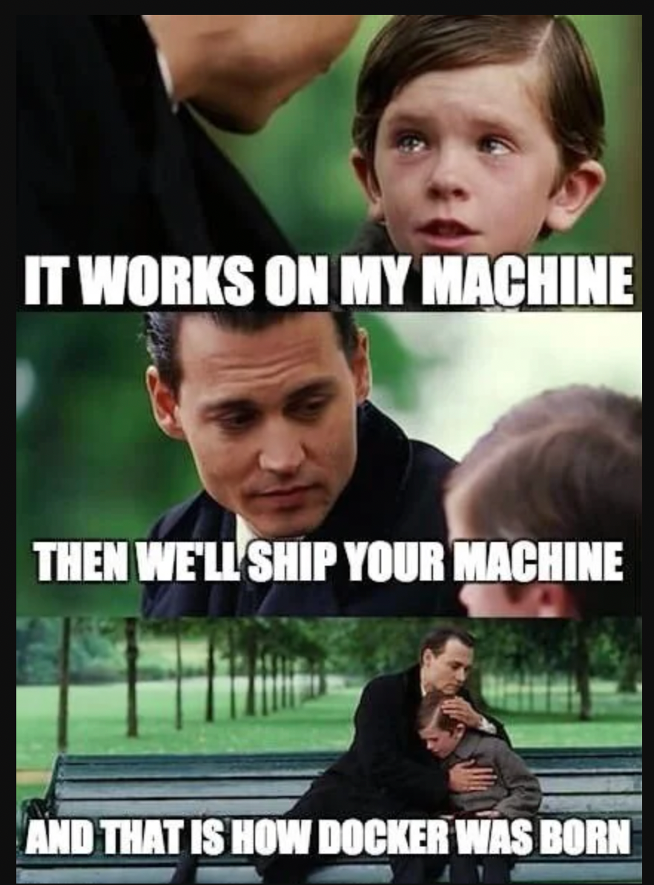

# inception

-virtualization vs containarization: https://www.trianz.com/insights/containerization-vs-virtualization#:~:text=Containerization%20is%20a%20form%20of,isolate%20processes%20from%20one%20another.

### Virtualization
Is a technology that lets you create usefule IT services using resources that are linked to hardware. It allows you to use the physical machine by distriburing it's capabilities.

#### Types of virtualization
<ul>
    <li>Data Virtualization:</li>
    <p>
        Consolidate data spread into a single source. The logical data management allows establishing a single data-access and real-time access to data stored across multiple heterogenous data sources.
        Examples of data virtualization tools:
        <a href="https://www.denodo.com/en/solutions/overview">Denodo platform</a>
        <a href="https://www.sap.com/products/technology-platform/hana.html">SAP Hana</a>
        
    </p>
    <li>Desktop virtualization</li>
    <p>
        Different from OS virtualization, Desktop virtualization allows a central administrator to deploy simulated desktop environments to hundreds of physical machines at once. Unlike traditional desktopn evironment that are physically installed and configured, desktop virtualization allows admins to perform mass configurations on all machines.
        Programs like Virtual box, Qemu or VMware... could fall under the Desktop virtualization category.
        
    </p>
    <li>Server virtualization</li>
    <p>
        Server virtualization is dividing physical servers into isolated virtual ones, allowing each virtual server to host it's own OS.
        
    </p>
    <li>Operating system virtualization</li>
    <p>
        OS virtualization happens at the Kernel. It's a way to run Linux and Windows environments side by side. The Kernel enables the existence of various isolated user-space instances.
        
    </p>
    <li>Network functions virtulization</li>
    <p>
        Network functions virtualization separates the network's key functions (like directory services, file sharing, and IP configuration) so they can be distributed among environments.
        
    </p>
</ul>

#### How does Virtualization work?
Software called Hypervisors separate the physical resources from the virtual environment.

#### Hypervisors
<ul>
    <li> Introduction </li>
        <p>
        A Hypervisor is a type of software, that creates and runs virtual machines. 
        The Hypervisor presents the guest OS with a virtual operating platform and manages the execution of the guest operating systems.
        </p>
    <li> Hypervisors types </li>
    
    <ol>
        <li>Type1: native / bare-metal hypervisor</li>
        <p>
            This type of hypervisors runs directly on the physical hardware, without the need for a host os. It interacts directly with the hardware and constrols the allocation of physical resources to VMs. 
        </p>
        <li>Type2: Hosted Hypervisors</li>
        <p>
            This type of hypervisors runs on a conventional OS just like other computer programs. It relies on the host OS to manage hardware resources and provides virtualization layer on top of it. (Virtual box, VMware...)
        </p>
    </ol>
</ul>

#### KVM (Kernel-based Virtual machine)
<p>
    KVM is an open source virtualization technology built into Linux. KVM lets you turn Linux into a hypervisor that allows a host machine to run multiple Virtual environments.
    KVM converts Linux into a type1 hypervisor. Since it's already built inside the Linux Kernel, it has by default all the Kernel modules and components it needs.
    There are other tools similar to KVM but irrelevant compared to KVM (Like MS Hyper-V, but who cares about Windows!?)  
</p>


### Containerization
Containerization is the packaging of software code with just the OS Libraries and dependencies required to run the code to create a singel lightweight executable.<br>

We know that virtualization relies on the hypervisor to run virtual environment on another environment built on the physical envronment. Containerization in the other hand, operate on a higher level in the system stack, and is based on the main system's kernel to operate.<br>

Before jumping to containerization at runtime, we need to introduce 2 of the most important feature in Linux systems which containerization is based on: Namespaces and Cgroups. These features allow process isolation:

#### Namespaces
Namespacing is a feature of the Linux Kernel, that provides process isolation, by creating different namespaces for various system resources. <br>
Namespacing can easily done by running the unshare command, e.g:
```
$ sudo unshare --fork --pid --mount-proc sh
```
There are several types of namespaces that container runtime uses:
<ul>
    <li>PID namespaces: processes inside a container has their own process ID namespaces, meaning that the processes ran inside the container, are isolated from other processes run in the system outside.</li>
    <li>Network namespaces: Containers have their own Network interfaces, IP addresses and routing tables. Which allows networked applications to run independently.</li>
    <li>Mount namespaces: This allows containers to mount their own isolated filesystems. And changes made to these filesysems will not affect the host system.</li>
    <li>UTS namespaces: UTS(Unix Timesharing System) namespace is a form of namespacing that isolates the hostname and NIS(Network information service) domain name that are associated with a container. <br>
    If you want to know more about: <a href="https://www.ionos.com/digitalguide/hosting/technical-matters/hostname/">Hostname</a>, <a href="https://en.wikipedia.org/wiki/Network_Information_Service">NIS</a>, <a href="https://en.wikipedia.org/wiki/Linux_namespaces">Namespacing</a>.
    </li>
</ul> 

#### CGroups
CGroups (Control Groups), are a Linux Kernel feature that allows the allocation and management of system resources. It's used to provide the necessary system resources. Because by default in the user land, the kernel provides a certain amount of resources to processes ran. Example of resources: memory, CPU, block I/O, network(iptables/tc), huge pages(special way to allocate memory), RDMA(specific for InifiniBand / remote memory transfer)(Remote Direct Memory Access is a technology that enables two networked computers to exchange data in main memory without relying on the processor, cache or operating system of either computer.)<br>
Example of a cgroup that limits memory: <br>
```
$ sudo cgcreate -a redaoui -g memory:cgExample
```
#### seccomp-bpf
In addition to Namespaces and CGroups, it's only fair to mention the seccomp-bpf feature that allows you to restrict system calls. Which adds another level of security to our "containers".<br>
We also need to mention other security features like LSMs and capabilities.

#### more details 
You can find more detailed informations about the Containers internals <a href="https://container.training/intro-selfpaced.yml.html#679">here</a>.

#### Containers
From what we've read above, we understand that containers were just a small mixture of the Namespaces, CGroups and some filesystem magic. And secured using some features like capabilitiesm seccomp, LSMs...

### Why containers
There are many reasons why you should use containers, especially in some cases where it is vital for a task to be done virtually without the need of a Virtual Machine.



<ul>
    <li><b>Portable:</b> The diversity in Operating Systems nowadays makes it nearly impossible for developers to develop and maintain tools and applications on every system, thus making containerization a good choice to run stable applications in different environments.</li>
    <li><b>Lightweight</b> Containers are lightzeight and share the host OS kernel, which makes it way fast and light than traditional Virtual Machines. </li>
    <li><b>Fast deployment:</b> Containers can easily and rapidly be deployed, making them ideal for CI/CD pipelines.</li>
    <li><b>Security:</b> Containers are fairly secure, as they provide a level of isolation from the host machines, making them a good choice for sandboxing and testing.</li>
</ul>

### Docker
I won't go through the history of Containerization and how the first versions of Docker were released. So let's dive directly into Docker:<br>
Docker was built on top of LXC(operating-system-level virtualization method for running multiple isolated Linux systems on a control host using a single Linux kernel).<br>


<br>It has 3 main components:
<ul>
    <li>Docker Engine (dockerd): comprises the following components in this image: 
    
    </li>
    <li>docker-containerd (containerd): another system daemon service that is responsible for downloading the docker images and running them as containers.</li>
    <li>docker-runc (runc): is a container runtime responsible for creating the container components(namespaces, cgroups...) </li>
</ul>

#### Working environment
As we know, containerization, Docker containers specifically, are dependent of the host machine's Kernel. Meaning that you cannot run a Windows container directly in a Linux environment, or Linux container directly in Windows environment... You get the idea.<br>
To solve this problem, you can use the Docker Desktop client that allows to run containers that require a different Kernel than the host machine's (in Windows for example, Docker Desktop has an option to run Linux machines by providing a lightweight virtual machine based on HyperV to run a Linux Kernel, hence the ability to run Linux containers. So if you're on Windows you can do that, and then ask yourself why you're still using Windows).<br>

#### Installing Docker
I'm currently using a MacOs machine, and since I don't have admin privileges in this machine, and I hate using GUI client that are installed in this machine. I'll be using a Kali Virtual machine where I'll set up my Docker environment (I'll mainly use it to run Linux containers)<br>
If you're on Windows, MacOs or another Linux distribution, check <a href="https://docs.docker.com/desktop/">the Docker docs</a> and follow the steps to install on your host machine.<br>
<b>Tip:</b> if you decide to do the same, make sure to contantly take snapshots to avoid the need to fresh install if you messed things up while testing.<br>
Let's get started!<br>
I have my Linux guest machine ready, and to avoid slow response when directly using the terminal inside the virtual machine, I'll be access it remotely through ssh.


In many Linux distributions, there is already a package named docker, but the Docker we need is under another name (docker.io).<br>
To install and run the Docker Daemon:
```
kali@kali:~$ sudo apt update
kali@kali:~$
kali@kali:~$ sudo apt install -y docker.io
kali@kali:~$
kali@kali:~$ sudo systemctl enable docker --now
kali@kali:~$
```

#### Hello world!


Let's start by testing a lightweight container called <b>busybox</b> and run a simple command in it. (busybox is a small container used in embedded systems)<br>

Let's run something heavier this time. Let's run an interactive pseudo-terminal of a Debian release:
```
sudo docker run -it debian
```


#### Detached mode
Using the "-d" flag, enables detach mode, allowing the container to run in the background.<br>
You can see the containers informations of the containers running in the background using the command ps: (you can also see the containers that were stopped by adding the -a flag)
```
$ sudo docker ps 
```


While running in the background, each container has a logs file that registers output from the stdout. The logs can be accessed using the command : 

```
$ sudo docker logs CONTAINER_ID 
```

Where CONTAINER_ID is the id of the ID of the contianers obviously (you can use the first distinct 2 or plus characters of the id). <br>
Now that we have a bunch of containers in the background, it's time to put some of them down. There are two ways we can terminate our detached containers with: 

#### Stopping running containers
```
$ sudo docker kill CONTAINER_ID
$ sudo docker stop CONTAINER_ID
```

The different between the two is the signal sent. kill send the the SIGKILL signal while stop send the sigterm signal. Learn more about those 2 signals <a href="https://linuxhandbook.com/sigterm-vs-sigkill/"> here</a>.<br>
You can run stopped containers again using Docker start command. It will then restart using the same options that you run it first with.


#### From detached to interactive and vice versa
Another interesting fact is the transitioning between interactive (when the contianer is run using the -it flags) and detached mode (when ran using the -d flag):<br>
You can go from interactive to detach by sending ^p^q signals or killing the Docker client. (note that this will not work in Windows powershell)<br>
You can also detach it by defining detach-keys at docker run. e.g:
```
$ sudo docker run -it --detach-keys ctrl-h CONTAINER_IMAGE
```

Or you can go from detach to interactive mode by using the Docker exec command:
```
$ sudo docker exec -it CONTAINER_ID PATH_TO_SHELL_BINARY
```


### Docker images

#### Image?
An image is a lightweight package (not to confuse with Linux packages) that contians everthing needed to run a set of programs. It's a combo of files and metadata(image author, env variables, list of commands to run and build time...), forming layers stacked on top of each other.<br>
Images are made of leyers, where each layer can add, change and remove files.<br>
An easy way to visualize images, layers and containers in OOP:
<ul>
    <li>Images : classes</li>
    <li>Containers: objects</li>
    <li>Layers : inheritance</li>
</ul>


#### Manage images
You can find 3 namespaces for Docker images:
<ul>
    <li>Docker official images: curated open-source images.</li>
    <li>User/Orgs images: images from publishers verified by Docker Inc.</li>
    <li>self-hosted images: images that are not hosted on Docker Hub, but on third party registries.</li>
</ul>
To show the Docker images stored in your host (has images pulled and created):

```
$ sudo docker images
```

Or search for images from the Docker registry:

```
$ sudo docker search DOCKER_IMAGE_NAME
```

You can manage Docker images (pulling and pushing images) using the Docker client either by storing them in your Docker host or in a Docker registry.<br>
Docker has a built-in caching system that takes a snapshot after each build step, and before executing a step checks if has the built step cached for optimization purposes. (you can force a no-cache during the build using --no-cache)

#### Creating new images
You can create new Docker images by either:<br>
<b>docker commit</b>: save all the changes made to a container into a new layer and creates a new image. (not very popular method) More informations about docker commit <a href="https://docs.docker.com/engine/reference/commandline/commit/">here</a>.

```
$ sudo docker commit --author AUTHOR_NAME CONTAINER_ID IMAGE_NAME
```

<b>docker build</b>: the best method to create docker images. It makes more maintainable and light-weight images...

#### Dockerfile
A Dockerfile is a blueprint, for a Docker image that is based on another image. (You can make an image from scratch, literally! Learn more <a href="https://docs.docker.com/build/building/base-images/#create-a-simple-parent-image-using-scratch">here</a>.)<br>

We can build a container image automatically using a Dockerfile. It's a series of instructions telling Docker how an image is constructed. It's built using the <b>docker build</b> command.

#### Anatomy of a Dockerfile

A Dockerfile, is made of a set of instructions, each representing a layer of the image that we want to produce.


Here is an example of a Dockerfile: 


#### Creating an image from a Dockerfile

To know more about Dockerfile, images and layers. Let's create our own simple Dockerfile: <br>
This is will generate a simple Docker image based on debian and that just infinitely pings google.com:


Let's build it now (running a docker build is similar to make, you need to be in the directory where your target Dockerfile is. Or you can specify the Dockerfile using -f (--file) flag)

```
$ sudo docker build -t test_image:v0.1 .
```


And run it : 


We can see the layers using : 


Now let's see something interesting. Let's make similar Dockerfile but instead of adding adding the command "ping google.com" inside of the Dockerfile, we execute it when we run the image: 

```
$ sudo docker run --name second_test_container -d second_test_image:v0.1 ping google.com
```


We can see that the CMD instruction that runs "ping google.com" inside our Dockerfile runs our command using "/bin/sh -c".<br>
As we know in Unix system, a process can trigger the execution of another independent process using the exec family syscalls. The Docker builder is lazy (but more secure as BourneShell (sh) has been maintained for far long than Docker, and is less susceptible of being vulnerable to input validation and other forms of attacks), he doesn't parse the commands taken but just forwards them to the shell to execute them. And that's why the shell syntax is used.<br>
Another way to execute those commands is by using the JSON list also known as the exec syntax. The idea is to seperate the arguments manually :

* RUN ["/usr/bin/ping", "google.com"]

> tl.dr : seperate arguements for the builder to execute your commands, otherwise he'll use the shell to execute them.

#### Docker PID 1

The very first process ran inside of a Docker container is assigned the process ID: PID 1. Thus has a very special role in the system.  
The PID1 process is responsible for the signal propogation to the other processes. When you send a SIGTERM or a SIGINT, the signals should be handeled by that process otherwise the PID1 will just get killed after 10 seconds.  
A good way to properly handle signals and control the container during run-time is to use a supervisor.  
A supervisor, is a tool through which we can run multiple processes while building our docker image. There are many supervisors. They're usually made for specific Os or distributions... Supervisord, systemd, runit, s6...  

#### Configure a simple container supervised by supervisord

I made the following Dockerfile. it installs the packages for supervisor and ping command, and sets up the configuration environment for supervisord, then executes supervisord that thus has PID1.


Then made the configuration file for supervisord. nodaemon=true tells him to run in foreground instead of running as a daemon. And the second part is the program behaviour that we want: in a loop, every 60, ping google.com and concatenate the output given in a file called pings.txt located in the root directory. 


Now when we run this in interactive mode we can see the following result 


And when I send a SIGINT signal: (notice the SIGINT sent using ^C)


#### Build-time


